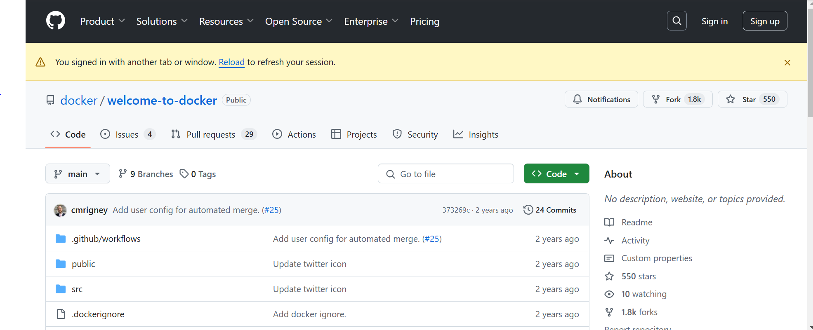
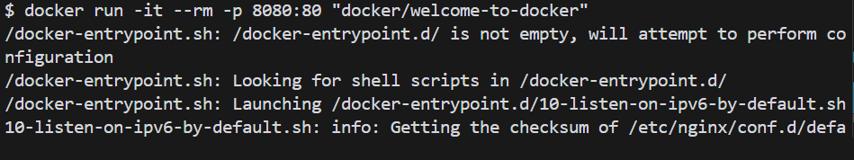
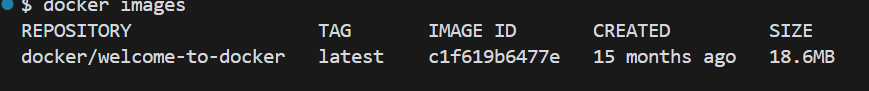
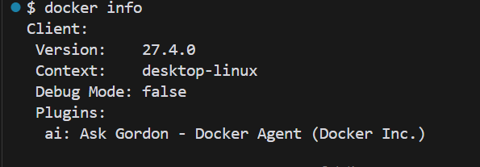
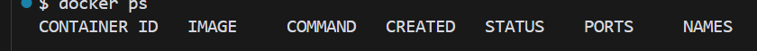
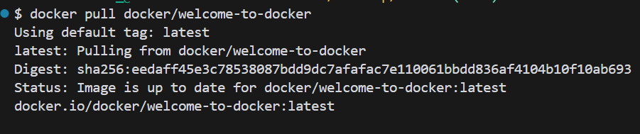
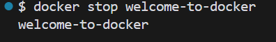
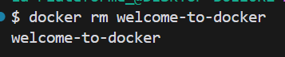

# Mon Projet Docker

Description de mon projet Docker.

## Images

Voici quelques images illustrant le projet :


Capture d'écran de l'application.


Description du container Docker.


Plus d'images.


Information.


Les processus.


Tirer une image.


Executer.


Stopper.


Supprimer.


Version.

## Installation

Instructions d'installation...


# Commandes Docker

 1. Supprimer un conteneur spécifique
Pour supprimer un conteneur spécifique en utilisant son ID ou son nom :
```sh
docker rm <CONTAINER_ID ou NOM_DU_CONTENEUR>

 2 .Pour supprimer plusieurs conteneurs à la fois :


docker rm <CONTAINER_ID_1> <CONTAINER_ID_2> <CONTAINER_ID_3>

3. Supprimer tous les conteneurs arrêtés
Pour supprimer tous les conteneurs arrêtés :


docker rm $(docker ps -a -q)

4. Forcer la suppression d'un conteneur actif
Pour supprimer un conteneur en cours d'exécution, il faut utiliser l'option -f (force) :


docker rm -f <CONTAINER_ID ou NOM_DU_CONTENEUR>

5. Supprimer une image spécifique
Pour supprimer une image spécifique, utilise son ID ou son nom :


docker rmi <IMAGE_ID ou NOM_DE_L_IMAGE>

6. Supprimer plusieurs images

Pour supprimer plusieurs images à la fois :

docker rmi <IMAGE_ID_1> <IMAGE_ID_2> <IMAGE_ID_3>

7. Supprimer toutes les images inutilisées
Pour supprimer toutes les images "dangling" (celles non utilisées par des conteneurs) :


docker rmi $(docker images -f "dangling=true" -q)

8. Supprimer toutes les images non utilisées
Pour supprimer toutes les images non utilisées par des conteneurs (y compris celles qui ne sont pas étiquetées) :


docker image prune -a

9. Forcer la suppression d'une image
Pour forcer la suppression d'une image, même si elle est utilisée par un conteneur :


docker rmi -f <IMAGE_ID ou NOM_DE_L_IMAGE>